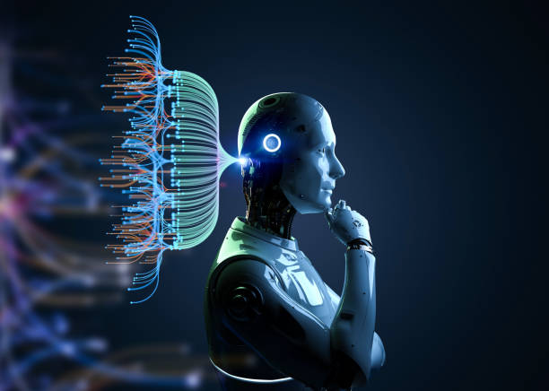

*Our intelligence is what makes us human, and AI is an extension of that quality. Artificial intelligence is extending what we can do with our abilities. In this way, it’s letting us become more human - Yann LeCun (French American Computer Scientist primarily working in the fields of machine learning and computational neuroscience)*

This quote highlights the idea that intelligence is a defining feature of humanity, and AI enhances our natural abilities. It suggests that by expanding our capabilities, AI allows us to reach new heights, ultimately making us more human.

### Introduction: The Double Edged Sword of AI in Education
I think AI has become an essential part of modern education, especially in fields like Software Engineering. In ICS 314, I’ve had the opportunity to explore various AI tools that have helped me with both the theory and practice of software development. Tools like ChatGPT, Claude, Blackbox, and GitHub Copilot have been useful, offering quick answers to questions or helping me understand complicated code concepts. These tools are based on powerful AI models that can assist in problem-solving, which is why I think they are so useful for students learning software engineering. In this essay, I will reflect on how I have used AI tools in ICS 314 and how they have shaped my learning experience. I will discuss how these tools helped me with coding assignments, class exercises, and even when working on the final project. AI has influenced my approach to learning by providing immediate feedback, suggestions, and examples, which made complex topics more accessible.

### Personal Experience with AI: A Tool, not a Crutch 
To start, with the **Experience WODS**. I tried my best not to use AI at first until I fully get stuck. I would search up additional resources and try not to use AI. There were many times whwere I felt that it was impossible for me not to do the experience WOD without AI. For example, in experience 18, I was able to understand the basic functional programming functions but it was hard for me to come up with the answer to use the right one or the right combinations. For the **In-Class practice WODs** , I felt more disciplined in attempting the WODs without the use of AI. I felt that I was more pressured to actually try and learn when I have peers and the professor around me. I felt some sort of integrity when I was in class doing group WODs.I felt that there shouldn't be a reason to use AI in group WODs because you aren't pressured to get the WOD done since it's not graded. Group WODs were made for us to ask questions and learn rather than using AI to completely do it for us. But one thing that broke my discipline was when one of the group members started using AI. When one member uses AI, it sort of ruins the need to want to get the answer yourself and just give up since the answer is there. Additionally, I feel that people have a status or something they want to prove when they want to get the right answer and explain to others. I feel that most people fear to explain their thoughts wrong or try to come up with answers that are wrong. For the **In class WODS**, I would try for the first half or so to try and understand the WOD and really try to learn and challenge myself. The first few WOD's of basic typescript weren't too bad without AI. It was up until I got stuck with underscore functions where I needed the help the most. These class WODs were graded and so my grades were on the line. I just had to use AI. I felt guilty using it despite it being allowed. It became a bad habit knowing that I can just use AI to save my grade. The WOD's I barely used AI was during the last few WOD's that included front end programming. The HTML and CSS WOD's were do-able without AI since I already had a solid background dating back to when I was in high school. As for the bootstrap, react and Next.js, I used AI only to fix a small bug. I found that most of the AI tools were not very useful when it came to front end design mainly because they aren't really capable of visually examining the end product of the code.

For the **Essays**, I mainly used AI to help brainstorm ideas to outline on how to write the essay. I would prompt GPT things like, write me a rough outline for this essay, or write me interesting titles for the outline of this essay. I would then write my own thoughts topics. It helped me be more creative instead of just staring at a blank file for hours. At times I would get stuck trying to get my words across properly with proper grammar and so I would ask GPT to help me fix my sentences and words.

For the **Final Project**, it would not have been possible for me to accomplish without the use of AI. There were countless times I hated AI and also thanked AI for helping me with the project. There were bugs the AI couldn't solve that I was able to solve. The times that AI didn't solve my bugs really forced myself to learn and debug myself. At times I truly felt like I understood it when AI didn't get it. One AI tool that really helped me with debugging was Claude AI and github copilot since they were able to fully see most of my code and my coding project. I used AI for almost all of my final project. From setting the database up to connect for deployment, to debugging extreme problems that required looking at multiple tsx files. I even used it for proper command lines that I couldn't find elsewhere on the internet. I used Blackbox mostly for the frontend fixes because it was unreasonably good with UI. One major help of AI use was when I needed a way to upload and display photos. I wasn't able to use NEONDB for cloud storage and only use it by storing generated urls of images. So I had to ask GPT, Claude, and CoPilot to help me learn AWS. I couldn't find the right tutorials or forums online to specifically handle my case of using AWS. AI was able to help teach me not just coding but also using the AWS dashboard for IAM user, policies, and S3 buckets. 

When it comes to **Learning a concept or tutorial**, I would use AI if there is a specific case that can't be found on the internet. Most of the tutorials on youtube or on forums are basic and general knowledge of materials and so AI came in handy. For example, not every tutorial of using an S3 Bucket applied to what I needed in my final project. There were many ways to approach it and I believed that I prompted AI efficiently to get the results I wanted. There were many times I disliked the implementation or approach AI would give. For my final project. I disapproved solutions that inlcuded API in which I managed AI to come up with solutions that avoided using API. When it came to debugging, I learned a lot of concepts that I didn't fully understand. If it's quick simple questions I relied on AI but if it was major basics I would watch videos on it.

In terms of **Asking or answering a smart question**, for the most part AI was able to answer most of my questions. I think that for AI to fully answer your question, you need to be a good prompter. Not ever answer that was given to me was the best, it only got better as I prompted follow ups and trained it to become more understanding.

A **Coding Example** prompt that I asked GPT was "Give an example of using the map function". I've used the map function so many times that I couldn't really understand it fully because it felt like magic in my project. So I prompted it to use map function in basic use and not my actual project implementation just yet so I could fully understand and not run into future bugs. 

When it came to **Explaining Code**, there were times where I was endlessly prompting copilot to fix my bug and one solution would finally work. I wouldn't understand it and so i would prompt copilot for example, "Why does this solution work, explain this code line by line like in a sentence, "Im passing ... here and when passed .. this becomes... or for every... ". It eventually would give me a better understanding afterwards.

With **Documenting code**, it would mostly write the comments for me when it comes up with solutions which I found very useful because I wouldn't need to ask to explain the code. It would sometimes go to the specific line just to explain to me what's going on in that line.

In terms of **Quality Assurawnce**, I would prompt copilot things like "whats causing this code to give this unwanted output" or "Why does it keep doing this incorrectly". At times there was no way out of an ESlint error whether prettier would auto format save and give me an ESlint error or if I fix it myself it wouldn't fix. So I would prompt copilot saying "How do I fix this ESlint error by adjusting my eslintrc.json file".

One **major use** in ICS314 that is **not listed** would be command lines. I've became so much more comfortable with git workflow with the help of AI. I was able to learn more about git command lines instead of using github desktop. I learned about upstream and forked repo workflow. I learned about npm installations, npx prisma commands and version controlling in git. Without AI, helping me with command lines, I would be stuck on the internet using the wrong commands.

### Impact on Learning and Understanding: Fast Track to Comprehension
I think AI has had a positive impact on my learning in ICS 314, especially in terms of speeding up my problem-solving process. It’s allowed me to quickly get unstuck when I was having trouble understanding a concept or writing code. For example, if I didn’t understand a particular function or method, I could ask AI for a quick explanation and get back on track without having to spend hours looking through documentation or forums. I feel that AI has helped me develop my problem-solving skills because it often presents solutions in multiple ways, allowing me to see different perspectives. However, I also noticed that over-relying on AI could make me lazy in my thinking, as I sometimes skipped over the process of figuring things out on my own.

On the other hand, using AI too much has made me more dependent on it for quick answers, which I think can limit deeper learning. For instance, instead of trying to work through a coding problem by myself, I sometimes used AI as a shortcut. This has made me realize that while AI is a great tool, it’s important to balance its use with independent problem-solving to really master the material. Additionally, I think AI can sometimes provide answers that are too broad or generic, which may not be ideal when trying to solve specific problems in a course like ICS 314. Overall, AI has helped me learn faster and more efficiently, but I’ve also become more mindful of not relying on it too much.

### Practical Applications: Beyond the Classroom
Outside of ICS 314, I have used AI in a few personal projects, especially when I need quick coding examples or debugging help. For instance, when I was building a small web application, I used GitHub Copilot to help me write certain functions faster, like creating form validation. It suggested relevant code snippets that I could use directly, saving me time. However, the suggestions were sometimes not optimized for my project’s specific needs, so I had to tweak them. This showed me that while AI can speed up coding, it still requires human input to ensure the code is effective and meets specific requirements. In group projects, I’ve also seen teammates use AI for brainstorming ideas or generating code templates, which helped get the ball rolling. I feel like AI is most useful when working on repetitive or well-defined tasks but less so when the project requires a high degree of creativity or innovation. 

One major example of using AI beyond the classroom was the HACC. I feel guilty in saying this, but I wouldn't have been able to place 2nd place in the Hawaii Annual Code Challenge without the use of AI. We used AI more of a support to help us with our creative thoughts and designs to solve the challenge. We came up with ideas to accomplish the challenge and AI wwas there to assist us. We even used AI to help us prompt our AI. We used it to help us come up with ways to put in helpful prompts into our AI agent so that our own AI on the website was able to effectively give excellent responses.

### Challenges and Opportunities: Striking the Balance
One challenge I faced when using AI in ICS 314 was dealing with incomplete or incorrect answers. Sometimes, the AI would provide a solution that looked good at first, but when I tried to implement it, it didn’t work as expected. There were many times in my Final Project where it tried to fix issues that weren't even the main issue. I feel that you can't really make AI give you the exact and right answer. The right answer comes from you critically thinking about the logic in solving your issues. AI can help you think but it won't give you the exact answer. I learned this when it came to setting up my database. I had to ask AI how the relations work but I had to manually think of the logic to connect my data together. I think this can be frustrating because it wastes time trying to figure out why the AI’s answer didn’t work. I also felt that AI sometimes oversimplified explanations, which made me miss important details about a topic. This made me realize that while AI is helpful, it’s not always a substitute for deep study and understanding. However, I think AI also presents great opportunities for personalized learning. For example, if AI tools could better tailor their explanations to individual learning styles, they could become even more effective in helping students master complex topics.

### Comprehensive Analysis: Traditional vs AI-Asisted Learning
When comparing traditional teaching methods to AI-enhanced approaches in ICS 314, I feel that AI provides a more flexible and immediate way to engage with the material. For example, with AI, I can get real-time feedback on my coding practices and even ask questions outside of class hours, which is not possible with traditional teaching methods. However, I also think that traditional methods, like having direct interaction with a professor or peer, offer something that AI can’t fully replicate human insight and personalized guidance. I feel that AI can enhance knowledge retention by providing additional resources or explanations, but it doesn't always capture the nuances of a particular concept the way a teacher might. I believe a balanced approach, combining the best of both traditional methods and AI tools, would lead to the best learning outcomes.

### Future Considerations: AI’s Expanding Role in Education
Looking ahead, I think AI will play an even bigger role in software engineering education. I imagine that future AI tools will be more sophisticated, providing more context-specific explanations and helping with more advanced problem-solving tasks. AI could also become better at assessing individual learning progress and suggesting personalized learning paths. However, I think it’s important that AI doesn’t take over entirely. It should remain a tool that complements traditional education methods rather than replace them. I believe that educators will need to focus on teaching students how to use AI responsibly and effectively, so they don’t become overly reliant on it. The challenge will be finding ways to integrate AI that maintains the value of human creativity, critical thinking, and collaboration in education.

### Conclusion: The Frenemy That Shapes My Learning
In conclusion, my experiences with AI in ICS 314 have been both positive and enlightening. AI tools like ChatGPT and GitHub Copilot have helped me solve problems more quickly and improved my understanding of software engineering concepts. However, I’ve also learned that AI can sometimes provide answers that require further refinement and that it’s important to maintain a balance between using AI and independent problem-solving. I think the future of AI in software engineering education looks promising, but there will always be a need for human insight and creativity. Going forward, I believe AI can continue to enhance the learning experience, as long as we use it wisely and in conjunction with traditional methods.

