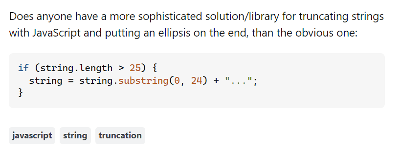

*There are naïve questions, tedious questions, ill-phrased questions… but every question is a cry to understand. There is no such thing as a dumb question - Carl Sagan*

### Why Smart Questions Matter
Good communication is crucial for software engineers, and asking questions the "smart way" can greatly improve the quality of the answers you get. Eric Raymond’s essay, "How to Ask Questions the Smart Way," provides clear guidelines for asking questions that are easy to understand and likely to get helpful responses. By looking at examples from StackOverflow, we can see how following these guidelines leads to better results and how not following them can cause problems.

### An Example of a Smart Question
Take a look at the StackOverflow question titled “Smart way to truncate long strings” (source). The user asks for a better way to truncate strings in JavaScript and add an ellipsis. The question is well-done: it clearly states the problem, shows an initial solution, and asks for improvements. This setup invites detailed, useful answers that address different aspects of the problem, such as handling HTML tags and word boundaries. This example shows how a well-formulated question can lead to a range of helpful answers and spark useful discussions.

In this case, the answers are detailed and directly tackle the user's needs. The community provides various solutions, including JavaScript functions and CSS techniques, reflecting the clarity of the original question. This demonstrates how smart questions can lead to effective problem-solving and helpful interactions.

### The Pitfalls of Poorly Formulated Questions
On the other hand, consider a question like “Help with my code” which lacks detail. A user asking, “My code isn’t working. What’s wrong?” without giving any specifics or code is likely to get vague and unhelpful responses. For example, a question that simply asks, “Why does my application crash?” without error messages or context will probably result in minimal assistance and frustration for those who want to help.

Such questions often lead to generic responses and less engagement from the community. This shows how asking vague or poorly structured questions can make it harder to get useful help and can discourage others from participating.

### Conclusion
Comparing smart and poorly formulated questions on StackOverflow highlights how important the quality of your question is for getting good answers. Smart questions are clear, provide context, and show effort, leading to valuable and comprehensive responses. In contrast, vague or poorly structured questions often result in less helpful answers. By following the guidelines for asking questions the smart way, software engineers can improve their chances of finding solutions and contribute to a more helpful and efficient community. So, next time you have a technical question, remember: asking smart questions not only helps you get better answers but also makes the experience better for everyone involved.
