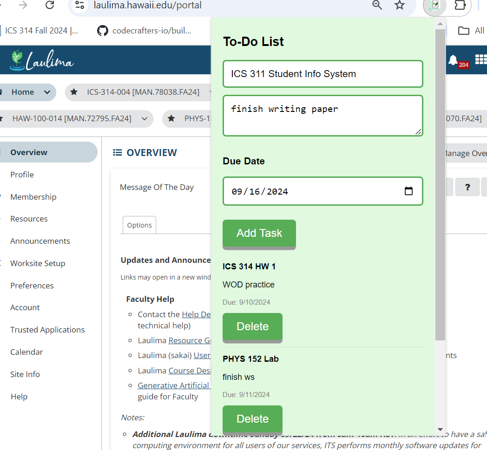

  

## A Laulima Chrome Extension to create a TODO list of assignments.

### PROBLEM:
A problem I was facing was having trouble making a TODO list whenever I would go to Laulima. It was too much of a hassle typing the list on my phone or using another application on my computer to make a TODO list for my homework. I didn't like having to look at my phone to see where I gathered all of my TODOs. Additionally, I often found myself jumping between different apps or tabs, which made the process inefficient and prone to distractions. It became increasingly hard to keep track of upcoming assignments and due dates as the semester progressed, leading to a lot of missed deadlines. I needed a solution that would integrate directly with my workflow on Laulima.

### SOLUTION:
I created a Laulima Chrome extension where you can add and delete TODOs. The TODO's input would include the homework name, the details about the homework/TODO, and finally, you can select on the calendar when the due date is for that assignment. The list is organized from the earlier due dates to the later due dates. This allows students to stay focused on the Laulima platform while keeping their assignment tracking in one place. By having everything within a single browser extension, it reduces the need to switch between devices or tabs, ensuring a smoother, more efficient workflow. With a clear visual of tasks, students can prioritize their time more effectively and avoid missing important deadlines.

  

### TECHNOLOGIES:
HTML, CSS, JAVASCRIPT, JSON

### Why LimaNotes:
Having LimaNotes helps you stay productive and be mindful of what assignments are due. When you hop on Google Chrome and log in to Laulima, you can easily organize the notes all in one screen and application. You can finally see all the homework assignments that are due in one place instead of going to individual class links. This reduces the clutter of constantly switching between Laulima tabs and external to-do list apps, streamlining your workflow. LimaNotes integrates seamlessly into the Laulima platform, ensuring you never miss an assignment by providing an intuitive, centralized hub for managing your coursework. It makes staying on top of your tasks simpler and more efficient, allowing you to focus on what's important—completing your assignments on time.
 
Source: <a href="https://github.com/jogarces/ics-313-text-game"><i class="large github icon "></i>LimaNotes</a>
