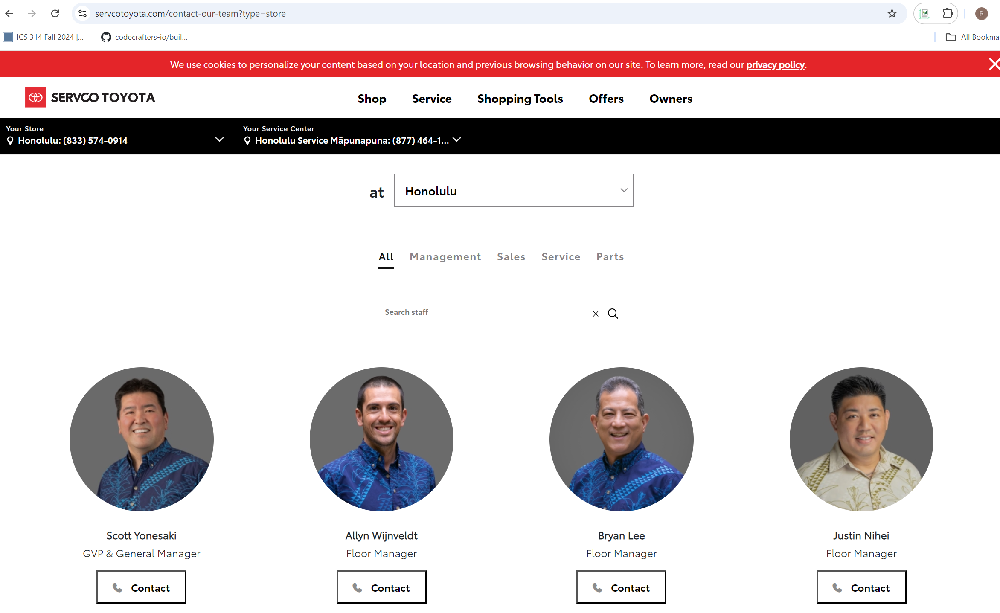

  

### SERVCO Contact Our Team Page
During my Software Developement Internship, I contributed in creating a page where users can contact the staffs at SERVCO. 

  

## Features:
The page shows a list of the staffs with their names, profile pictures, and job position. There are filteres to filter out the staffs. Filters include store location, department they work in such as management, 
sales, services or parts. When clicking on the contact button, it shows their contact card, their phone number, email, and job position.

## My contribution to the project:
I helped format the frontend displaying the staff pictures and filters. I wrote the code to match I helped format the frontend displaying the staff pictures and filters. I wrote the code to match the wanted design according to my UI/UX designer. I worked on the backend to pull data from Workday and filter out which staff to display based on their location. The content on the page would be refreshed using an AJAX call for runtime efficiency. Salesforce Commerce Cloud was used for managing the objects and fields. I also helped create the contact cards and some of the filter buttons. I utilized JavaScript and jQuery to implement dynamic filtering and ensure smooth interactions between the UI elements. XML and JSON were employed to handle data formatting and communication between the frontend and backend systems. Using Bootstrap, I ensured that the design was responsive and visually consistent across different devices and screen sizes.

## Technologies:
- JavaScript
- XML
- jQuery
- Salesforce Commerce Cloud
- Bootstrap
- Postman API
- JSON

Source: <a href="https://www.servcotoyota.com/contact-our-team?type=store" target="_blank">SERVCO CONTACT OUR TEAM</a>

